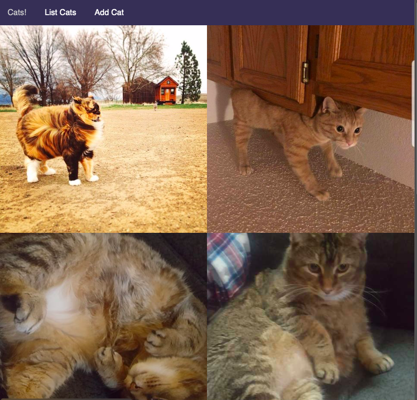

# README

In this simple example, I created/modified these files

* [`config/routes.rb`](https://github.com/newjam/rails-demo/blob/master/config/routes.rb)
* [`app/controllers/cats_controller.rb`](https://github.com/newjam/rails-demo/blob/master/app/controllers/cats_controller.rb)
* [`app/models/cat.rb`](https://github.com/newjam/rails-demo/blob/master/app/models/cat.rb)
* [`app/views/cats/index.html.erb`](https://github.com/newjam/rails-demo/blob/master/app/views/cats/index.html.erb)
* [`app/views/cats/new.html.erb`](https://github.com/newjam/rails-demo/blob/master/app/views/cats/new.html.erb)
* [`app/views/cats/show.html.erb`](https://github.com/newjam/rails-demo/blob/master/app/views/cats/show.html.erb)
* [`app/views/layouts/application.html.erb`](https://github.com/newjam/rails-demo/blob/master/app/views/layouts/application.html.erb)
* [`app/assets/stylesheets`](https://github.com/newjam/rails-demo/tree/master/app/assets/stylesheets)
* [`db/migrate/20190625011518_create_cats.rb`](https://github.com/newjam/rails-demo/blob/master/db/migrate/20190625011518_create_cats.rb)

